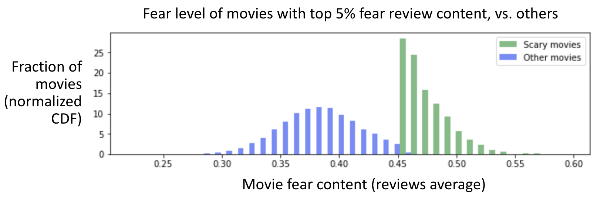
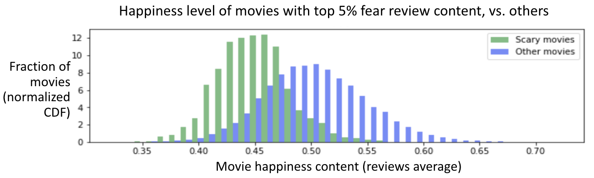
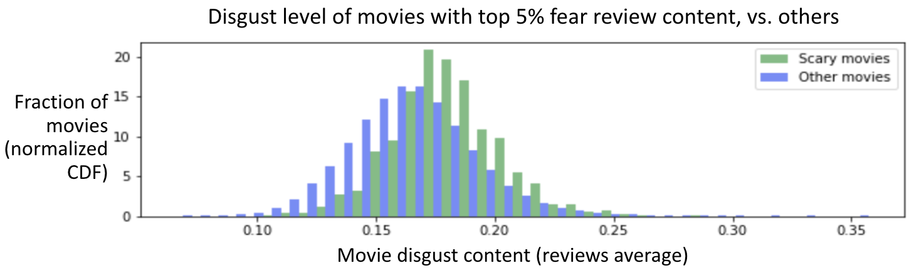
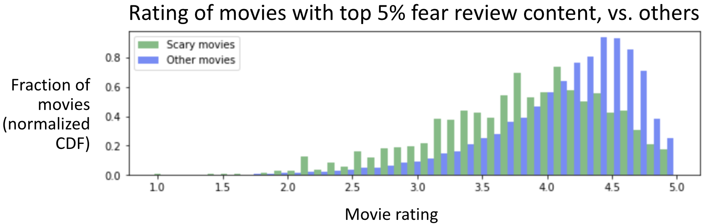

# Movie Mood

A mood-based movie recommender system

## Motivation

When I search for a movie to watch, I usually look for a movie that fits my mood. Movie genres and stars are not very helpful to me.

## Vision

As a user, I would like to input key aspects of the mood I’m looking for, and get movies that best match that mood.

## Approach

1. Data gathering & cleaning (completed)
2. Basic exploratory data analysis with bag of words approach (completed)
3. Apply machine learning techniques (TBD)

## Challenges

I did not expect movie comments to contain emotions about three different topics:

1. The quality of the movie ~ star rating (i.e. good/bad movie).
2. The content of the movie (i.e. scary movie)
3. The support of the movie (i.e. bad DVD), due to my comment source: Amazon. I was able to remove these types of comments in step 1 below

## 1. Data gathering & cleaning

I obtained 4.6 million Amazon movie & TV reviews from J. McAuley of UCSD, which he collected for the research paper: *Ups and downs: Modeling the visual evolution of fashion trends with one-class collaborative filtering
by R. He, J. McAuley, WWW, 2016 [pdf](http://cseweb.ucsd.edu/~jmcauley/pdfs/www16a.pdf)*

I removed comments potentially about the support (e.g. problem with DVD quality) through keyword search.

I removed movies with fewer than 10 comments.

## 2. Basic data analysis with bag of words approach

### 2.a Bag of words model with 7 emotions

I used a dataset of 23 thousand keywords labeled with the following 7 emotions: 'disgust', 'surprise', 'anger', 'sad', 'happy', 'fear' and 'neutral' (7 emotion dimensions).

### 2.b Application of bag of words model to movie comments

I created an emotion vector for each comment by adding the emotion dimensions values of each keyword found in comment text.

At first, I did not normalize this vector, and obtained very strange results (all emotions varied in lock step and the happiest movies had lower ratings than average). These problems came from the fact that the most highly rated movies have shorter comments than others on average, hence fewer keywords and smaller emotion vectors.

To solve this problem, I normalized the emotion vector of each comment, and for each movie, I averaged the emotion vectors over all comments for the movie.

### 2.c Tested for separation of emotions on content from emotions on movie quality

I looked for the emotion least likely to relate to movie quality, so most likely to relate to movie content, and selected 'fear'. So I isolated the movie with top 5% ‘fear’ review content:

As expected, movies with high fear review content have less happy content than other movies:

And movies with high fear comment content have a little more disgust than other movies:

#### Hypothesis testing

I made the null hypothesis that movies with top 5% fear review content have an average movie rating.

Welch's T-Test proved the null hypothesis wrong (p-value = 0.00).

Mann-Whitney's U-Test confirmed that movies with top 5% fear review content have an average movie rating below the general average (p-value = 0.00).

So fear is negatively connected to movie rating.

Several explanations are possible:

* Maybe scary movies are generally not as well made as other types of movies
* Maybe people express fear when they rate a movie badly

## 3. Advanced Machine Learning techniques

This part is TBD.

## Learnings so far

**The power of the solution hinges on the meaning included in the input data, so the relevance of the input data to the objective is critical, and its selection, when there is a choice, is key**:

* Amazon reviews are challenging because they cover the content, the support and the quality of movies

**Normalization is useful to avoid introducing variance from unexpected sources**:

* 5-star reviews are shorter than others, on average

**In Data Science, Minimum Viable Product means**:

* With many potential directions of investigation, it’s important to define a clear goal, stay focused on it and re-evaluate whenever new knowledge is gained
* Working on a subset of the data to speed up development & debug
* Making note of potential problems/improvements asap, but working only on critical ones; knowing what is critical is key

## Slide presentation

A slide presentation of this readme file is available [here](https://drive.google.com/file/d/1p54SV5ERHJ8YivaocwmhvxZfILem1hSh/view?usp=sharing).

## How to run unit tests

In the project root directory, run: pytest test/unittests.py
