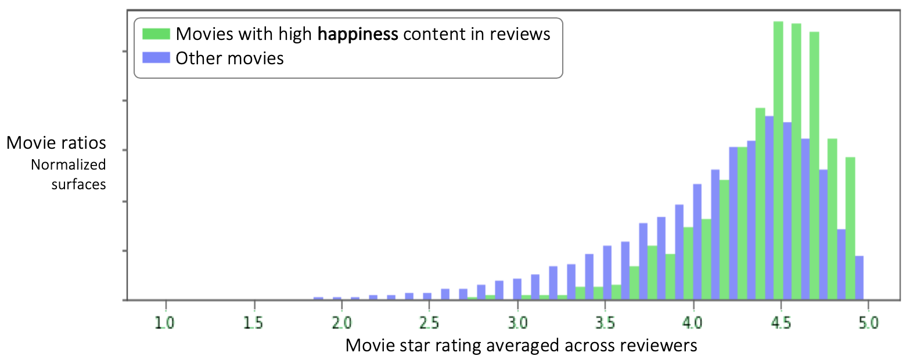

# Movie Mood: finding emotions in movies via reviews

## Objective

To extract emotions contained in movies, from movie reviews, filtering out plot descriptions, reviewers emotions about the movie, and comments about the support (Blu-ray…) or shipping. This is the foundation for a search engine that would allow users to select a movie based on the emotions found in the movie by reviewers.

## How the objective was achieved

Given a review such as: ‘Great movie! Takes place in an isolated outpost in the galaxy. The hero hates aliens. The Blu-ray contains awesome bonus material.’  
The goal was to isolate: ‘the hero hates aliens’.

#### 1. Removed support-related sentences
Removed support-related sentences (e.g. ‘The Blu-ray contains awesome bonus material’) via keyword search.

#### 2. Removed descriptive sentences
Removed descriptive sentences (‘takes place in an isolated outpost in the galaxy’) by vectorizing text into a space of 7 emotions and removing sentences below a threshold.

#### 3. Removed reviewers' feelings

Removed reviewers’ feelings by modeling the differences between feeling descriptions in plot (‘the hero hates aliens’) and the reviewer’s feelings (‘great movie!’).

## Research steps and findings
### Emotions correlate with star rating
I used the star ratings associated with the reviews as a way to validate my investigations. I found that negative emotions expressed in reviews correlate negatively with ratings, and positive emotions correlate positively with ratings:

Reviews with strong scared feelings have lower ratings than others:

Reviews with strong happy feelings have higher ratings than others:

It makes sense that reviewers' sentiments correspond to ratings. However, emotions in movies should not be very related to reviewers' ratings, as there are good scary movies out there! (there could still be some correlation between emotions in plot and reviewer ratings if, for example, making a good scary movie is generally more difficult than making a happy one)  

The bag-of-words approach above does not allow to differentiate between emotions in plot (‘the hero hates aliens’) and the reviewer’s emotions (‘great movie!’).

[Notebook for this section](./amzn_reviews_emotions.ipynb)

### Reviewer emotions vs. plot emotions separation

Since the bag of emotional words approach was not sufficient, I built a classifier to differentiate reviewer feelings from plot sentences.  

I also built a sentiment predictor model to test the classifier: assuming that a reviewers' emotions are the main determining factor of star rating, removing all sentences unrelated to the reviewers' emotions should not impact the ability of a sentiment predictor model to predict the star rating, but removing sentences of reviewers' emotions should.  

I computed the accuracy of the sentiment analysis model after the classifier removed either reviewer feelings or plot sentences. I found that removing sentences with reviewer feelings (blue bars below) reduced the accuracy of the sentiment predictor much more than by removing plot-related sentences (red bars below):

The height differences between the blue and red lines in the graph above show that my reviewer emotions vs. plot emotions classifier does a fairly good job.

[Notebook that creates a balanced data set to train the sentiment analysis model](./1_create_training_set_of_reviews_w_balanced_ratings.ipynb)  
[Notebook to create shortened reviews with reviewer or plot emotions removed](./2_Remove_some_sentences.ipynb)  
[Notebook that runs the sentiment analysis model on shortened reviews](./3_A_B_test.ipynb)  
[Notebook that displays the shortened reviews testing results](./4_AB_testing_result_analysis.ipynb)  

## Next steps

* Implement an LSTM model to better differentiate reviewer emotions & emotions in movies
* Create the emotion-driven movie selection UI

## Technical details

### Data set

I obtained 4.6 million Amazon movie & TV reviews from J. McAuley of UCSD, which he collected for the research paper: *Ups and downs: Modeling the visual evolution of fashion trends with one-class collaborative filtering
by R. He, J. McAuley, WWW, 2016 [pdf](http://cseweb.ucsd.edu/~jmcauley/pdfs/www16a.pdf)*

### Bag of words model with 7 emotions

I used a dataset of 23,000 keywords labeled with the following 7 emotions: 'disgust', 'surprise', 'anger', 'sad', 'happy', 'fear' and 'neutral'.

### Separating reviewer’s feelings from feelings in plot descriptions

#### Reviewer feelings vs. plot classifier
Used 5,000 sentences from a plot description site, and 5,000 sentences from rotten tomatoes for the labeled data. Cleaned up the labels manually by inspecting data misclassified by the models.

#### Sentiment classifier
Created it to validate the reviewer/plot classifier.

Isolated a set of 30,000 movie reviews with 5 sentences and balanced +/- sentiment, from the Amazon data set.

#### For both classifiers
Performed grid searches with logistic regressors, random forests and gradient boosting classifiers (GBC). Found best results with GBC.

## Slide presentation

A slide presentation of this readme file is available [here](https://drive.google.com/file/d/1CpffON2RjL-idEwLhmM73ZFLLSwfjmu8/view?usp=sharing).

## How to run unit tests

In the project root directory, run: pytest test/unittests.py
